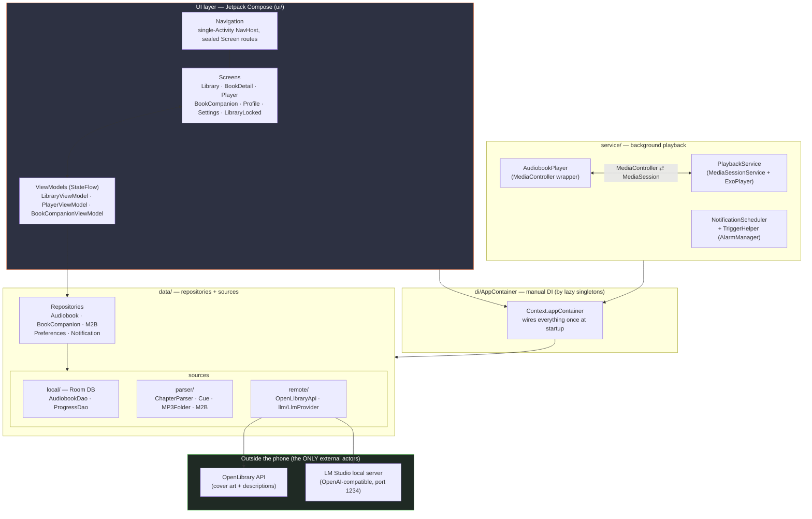
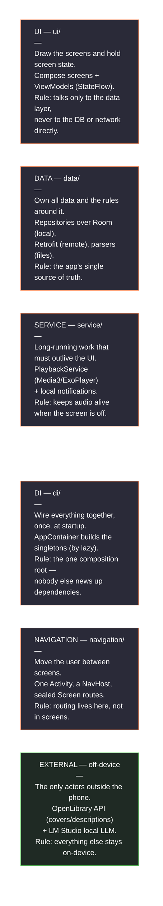
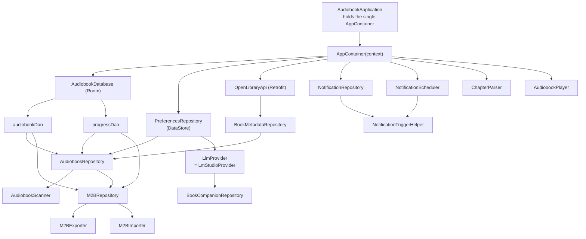
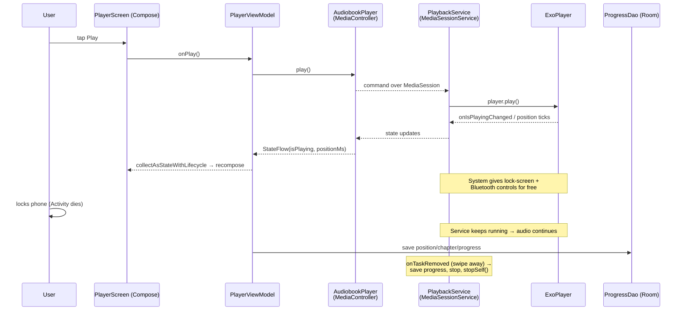
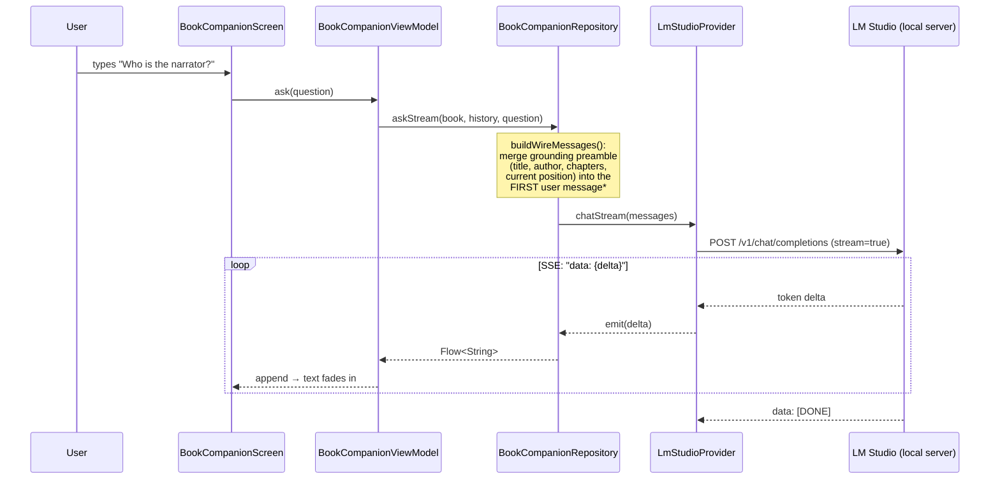
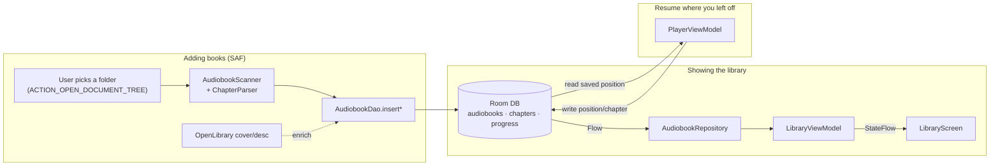
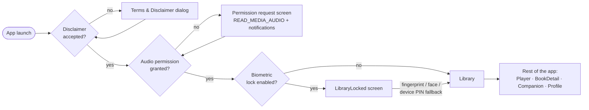
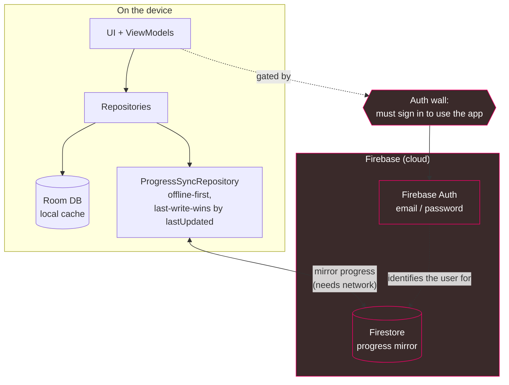
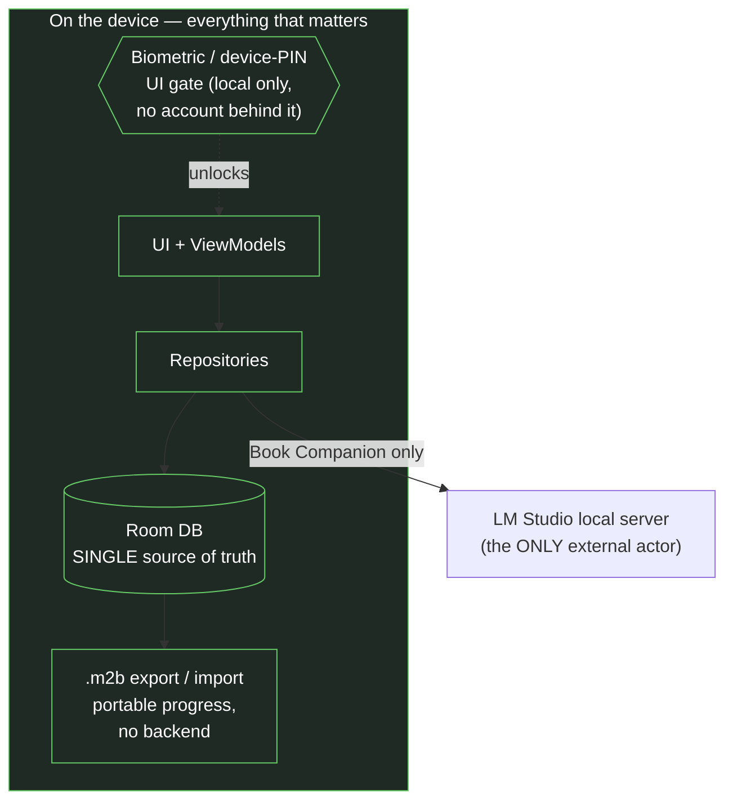

# Architecture (Technical Diagrams)

Visual companion to [`DECISIONS.md`](DECISIONS.md). Every diagram below is **Mermaid** — it
renders inline on GitHub and in most IDEs (VS Code with the Mermaid extension, Android
Studio with a Markdown plugin). The diagrams reflect the code as it actually is: a
single-module, **local-only** Android app (Kotlin + Jetpack Compose + Media3 + Room), whose
only external actor is a local LLM server.

Pre-rendered PNGs live in [`docs/diagrams/`](docs/diagrams/):

| File | Diagram |
|------|---------|
| `01-layered-architecture.png` | §1 Layered architecture |
| `02-compartment-purposes.png` | §2 What each compartment is for |
| `03-dependency-graph.png` | §3 Dependency graph |
| `04-playback-sequence.png` | §4 Playback sequence |
| `05-book-companion-llm.png` | §5 Book Companion (LLM) |
| `06-library-and-progress.png` | §6 Library load & progress |
| `07-startup-gates.png` | §7 Startup gates |
| `08-cloud-before.png` | §8 Before: cloud-backed |
| `09-cloud-after.png` | §8 After: fully local |

> **Regenerating:** `npx -y @mermaid-js/mermaid-cli -i ARCHITECTURE.md -o docs/diagrams/architecture.png -t dark -b "#1e1e2e" --scale 3`
> writes generic names (`architecture-1.png` …). Rename them back to the descriptive names above after rendering.

---

## 1. Layered architecture (the big picture)

Read top-to-bottom. Each layer only talks to the one below it. The UI never touches the
database or the network directly — it goes through a ViewModel, then a Repository.

---

## 2. What each compartment is for (note card)

One card per top-level package. Read it as: **compartment — one-sentence job — the rule it
obeys.** This is the "where does my code go?" cheat sheet.

> Mental model: a tap travels **NAVIGATION → UI → (ViewModel) → DATA**, occasionally reaching
> **EXTERNAL**; **SERVICE** runs alongside for playback; **DI** built all of them at launch.

---

## 3. Dependency graph (who creates whom)

`AppContainer` is the composition root. Everything is a `by lazy` singleton, so each box is
created **once**, the first time something asks for it. This is the hand-written version of
what Hilt would generate (see DECISIONS #1).

> Note the seam at `LlmProvider`: callers depend on the **interface**, never on
> `LmStudioProvider`. Swap the backend (on-device model, cloud, a fake for tests) without
> touching `BookCompanionRepository`.

---

## 4. Playback — the hard part

Why this is non-trivial: audio must keep playing when the screen is gone. So playback lives
in a **`MediaSessionService`** (a long-running background component owned by the OS), *not*
in the Activity. The UI controls it remotely through a `MediaController`.

Key configuration in `PlaybackService` worth being able to explain:
- `CONTENT_TYPE_SPEECH` + `handleAudioFocus=true` → auto-pause on phone calls, duck for notifications.
- `setHandleAudioBecomingNoisy(true)` → pause when headphones unplugged.
- `WAKE_MODE_LOCAL` → CPU stays awake so playback doesn't stall on a sleeping screen.
- Custom session commands: **−15s / +30s** skip buttons in the notification.

---

## 5. Book Companion — the local-LLM feature

Your standout feature. The flow shows the two things that make it interesting: the
**grounding** step (book context is injected so the model can't make things up), and
**streaming** (the reply fades in token-by-token over Server-Sent Events).

> *Grounding goes in the first **user** message, not a system message, on purpose: Mistral's
> chat template rejects the system role, and strict user/assistant alternation is the safe
> common denominator across local models (see `BookCompanionRepository` docs + the LM Studio
> setup note). `buildWireMessages` / `buildGroundingPreamble` are pure functions → unit-tested.

---

## 6. Library load & progress persistence (data flow)

How a book gets on screen and how "where I left off" survives an app restart. Room is the
**single source of truth** — `Flow` from the DAO means the UI updates reactively whenever
the data changes.

---

## 7. App startup gates (first-run → unlocked)

What `MainActivity` walks the user through before the real app appears.

---

## 8. From cloud to fully local (before & after)

The app **started life cloud-backed** and was deliberately stripped to **local-only**. This is
the single biggest architectural change in its history, and the reasoning is the kind of
trade-off an interviewer will want to hear (see DECISIONS #5 and #8).

> The "before" diagram is **reconstructed from the decision log** — that code has been removed
> from the repo. It's here to show *what changed and why*, not to describe current code.

### Before — Room as a cache, Firestore as the sync target, behind an auth wall

### After — Room is the single source of truth; the LLM is the only thing off-device

### What changed, and why

| | Before | After |
|---|--------|-------|
| **Progress store** | Room cache + Firestore mirror | Room only — promoted to single source of truth |
| **Identity** | Firebase Auth (email/password) | None — no accounts at all |
| **Library lock** | Biometric *plus* cloud auth | Biometric / device-PIN as a pure local UI gate |
| **Cross-device** | Sync via Firestore | `.m2b` export/import (manual, portable) |
| **Network needed?** | Yes, for sync + sign-in | No (only the optional local LLM) |
| **External actors** | Firestore, Firebase Auth, OpenLibrary | OpenLibrary + local LLM |

**Why remove it.** The cross-device use case didn't justify the cost: an account requirement,
a network dependency, Firestore security rules, and an auth wall — for a player whose audio
files live on the device anyway. Going local-only buys **zero accounts, zero network
dependence, and a smaller attack surface**; portability is handled by `.m2b` when actually needed.

**Honest residue.** Two columns on `ProgressEntity` (`isSyncedToCloud`, `chapterProgressJson`)
and the `getUnsyncedProgress` / `markAsSynced` DAO methods survive from the old design — left in
place to avoid a schema migration. They're inert today. (A good "what would you clean up next?"
answer.)

---

## Notes on the key terms

For each term: **what it is** (plain English) · **why it's here** (how *this* app uses it) ·
**a one-line answer** you can give if an interviewer asks. Grouped by the layer it lives in.

### UI layer

**Jetpack Compose / Composable**
- *What:* Android's modern UI toolkit. A "composable" is a function that *describes* what the
  screen should look like for the current state; the framework redraws it when the state changes.
  There are no XML layout files.
- *Here:* Every screen (`LibraryScreen`, `PlayerScreen`, …) is a `@Composable` function in `ui/screens/`.
- *"The UI is declarative — I describe the screen as a function of state, and Compose handles
  re-drawing. No XML, no `findViewById`."*

**ViewModel**
- *What:* A state-holder that lives **longer than the screen**. When Android destroys and recreates
  a screen (e.g. you rotate the phone), the ViewModel survives, so in-progress state isn't lost.
- *Here:* `LibraryViewModel`, `PlayerViewModel`, `BookCompanionViewModel`. The screen sends events
  up to the ViewModel; the ViewModel exposes state back down. The screen never touches a repository directly.
- *"ViewModels own the screen state and survive configuration changes. They're the seam between
  dumb UI and the data layer."*

**StateFlow / Flow**
- *What:* A **stream** of values you can subscribe to. A `Flow` emits a sequence over time; a
  `StateFlow` is a Flow that always holds a current value. When the value changes, every subscriber
  is notified automatically.
- *Here:* Room's DAO returns `Flow<List<...>>`, repositories pass it up, ViewModels expose `StateFlow`,
  and Compose collects it with `collectAsStateWithLifecycle()` — so the UI auto-updates when the DB changes.
- *"Data flows reactively: a change in the database propagates up the Flow chain and the UI
  recomposes on its own. I'm not manually refreshing anything."*

**MVVM**
- *What:* The overall pattern — **M**odel (data) / **V**iew (Compose screen) / **V**iew**M**odel
  (state holder). It separates "what the screen looks like" from "what the screen knows."
- *Here:* The whole `ui/` package follows it. See DECISIONS #2 for why MVVM over MVI.
- *"Standard Android architecture. View is passive, ViewModel holds state, Model is the repositories
  underneath."*

### Data layer

**Repository**
- *What:* A class that a ViewModel asks for data. It **hides where the data comes from** — database,
  network, file, or a mix — behind plain function calls. The ViewModel doesn't know or care.
- *Here:* `AudiobookRepository` is the clearest example — it pulls from Room (`AudiobookDao`), enriches
  with the OpenLibrary network call, and exposes one clean API. `BookCompanionRepository` hides the LLM;
  `M2BRepository` hides import/export.
- *"Repositories are the single source of truth for a data type. They decouple the ViewModel from
  the actual data source, so I can swap Room for something else without touching the UI."*

**Room**
- *What:* Google's official **database library** — a type-safe wrapper over SQLite (the small
  relational database built into every Android phone). You define tables as Kotlin classes and queries
  as annotated methods; Room generates the SQL plumbing at compile time.
- *Here:* `AudiobookDatabase` stores the library, chapters, and per-book progress. It's the **single
  source of truth** for the app — nothing leaves the device. Schemas are exported to `app/schemas/`
  (v1–v4) so migrations have a paper trail.
- *"Room is my local database. I chose it for the tight Jetpack integration, compile-time-checked
  SQL, and because its queries return Flows that compose with the rest of the reactive stack."* (DECISIONS #3)

**Entity**
- *What:* A Kotlin class annotated `@Entity` that maps to one **row shape** in a database table.
- *Here:* `AudiobookEntity`, `ChapterEntity`, `ProgressEntity` in `data/local/`. Note these are *not*
  the same as the UI models (`Audiobook`, `Chapter` in `data/model/`) — the repository maps between them,
  so the database shape and the UI shape can evolve independently.
- *"Entities are the DB representation; I keep them separate from the domain models the UI uses."*

**DAO (Data Access Object)**
- *What:* An interface of **query methods** for a group of tables. You write the `@Query` SQL (or use
  `@Insert`/`@Update`/`@Delete`) and Room implements it.
- *Here:* `AudiobookDao` (library + chapters) and `ProgressDao` (playback position). Read methods return
  `Flow` for reactive reads; write methods are `suspend` so they run off the main thread.
- *"The DAO is the typed query surface over the database — reads are Flows, writes are suspend functions."*

**DataStore**
- *What:* Android's modern **key-value preference store** (the replacement for `SharedPreferences`).
  Async, backed by a Flow.
- *Here:* `PreferencesRepository` uses it for small settings — playback speed, last-played book id,
  biometric toggle, disclaimer-accepted flag, the LLM server URL/model. Relational data goes in Room;
  loose settings go here.
- *"DataStore for small prefs, Room for relational data — different tools for different shapes."*

**Retrofit**
- *What:* A popular **HTTP client** library: you declare an API as a Kotlin interface and Retrofit
  generates the networking code.
- *Here:* `OpenLibraryApi` (fetch cover art + descriptions) and `LmStudioApi` (the LLM's
  OpenAI-compatible endpoint). Both are built in `ApiClient` / `LmStudioProvider`.
- *"Retrofit declares the remote API as an interface; I use it for OpenLibrary and the local LLM server."*

**SAF (Storage Access Framework)**
- *What:* The OS-level **folder/file picker** that grants an app *scoped* access to a location the user
  explicitly chooses — instead of broad "read all my storage" permission.
- *Here:* The user points the app at their audiobook folder via `ACTION_OPEN_DOCUMENT_TREE`; the app
  reads files through `DocumentFile`. Legacy storage permission is capped at `maxSdkVersion=32`.
- *"SAF over legacy storage permissions — scoped, user-controlled, and Play-Store-friendly."* (DECISIONS #7)

### Service / playback layer

**Media3 / ExoPlayer**
- *What:* Google's official **media playback engine**. ExoPlayer is the actual decoder/player; Media3
  is the current umbrella library that wraps it and adds session/UI integration.
- *Here:* One ExoPlayer instance lives inside `PlaybackService`, configured for speech audio, audio focus,
  and headphone-unplug handling.
- *"Media3/ExoPlayer is the supported modern path for audio. `MediaPlayer` couldn't do the chapter
  seeking and metadata I needed."* (DECISIONS #4)

**MediaSessionService**
- *What:* A special **background Service** that hosts a media player so playback **outlives the UI** —
  it keeps running when the Activity is destroyed (screen off, app backgrounded). It also exposes a
  standard "media session" the OS understands.
- *Here:* `PlaybackService`. Because it publishes a media session, you get **lock-screen, Bluetooth, and
  Android Auto controls for free**, plus a notification with custom −15s / +30s buttons.
- *"Playback lives in a MediaSessionService, not the Activity, so audio survives the screen dying and
  the system gives me media controls for free."*

**MediaController**
- *What:* The **remote control** the UI uses to talk to a `MediaSessionService`. The UI doesn't hold the
  player directly — it sends commands (play, pause, seek) to the session and receives state back.
- *Here:* Wrapped by `AudiobookPlayer`, which exposes the controller's state as Compose-friendly Flows
  so `PlayerViewModel` can consume it.
- *"The UI never touches the player directly — it goes through a MediaController, which keeps the UI
  and the background service cleanly decoupled."*

**Audio focus / "becoming noisy" / wake mode**
- *What:* Android audio etiquette. **Audio focus** = pause/duck when another app needs the speaker
  (a call, a notification). **Becoming noisy** = the event fired when headphones are unplugged.
  **Wake mode** = keep the CPU awake so playback doesn't stall when the screen sleeps.
- *Here:* All three are configured on the ExoPlayer instance in `PlaybackService.initializePlayer()`.
- *"I handle audio focus, headphone-unplug, and a wake lock — the things that separate a real media
  app from a toy one."*

### Cross-cutting

**Manual DI / `AppContainer`**
- *What:* **Dependency Injection** = giving an object its dependencies from outside rather than letting it
  create them. Frameworks (Hilt, Koin) automate this; this app does it **by hand** in one `AppContainer`.
- *Here:* `AppContainer` holds every singleton as a `by lazy` property and is reached via a
  `Context.appContainer` extension. It's the "composition root" — the one place everything is wired together.
- *"I wrote DI by hand. With ~7 repositories and one developer, a framework's annotation processing
  wasn't worth the build cost — and doing it manually forced me to think explicitly about object lifetimes."* (DECISIONS #1)

**`LlmProvider` (the interface seam)**
- *What:* An **interface** that defines "chat / stream / list models" without saying *how*. Callers depend
  on the interface; the concrete `LmStudioProvider` is the only thing that knows about LM Studio.
- *Here:* `BookCompanionRepository` depends on `LlmProvider`, never on `LmStudioProvider`. Swap in an
  on-device model, a cloud backend, or a fake for tests without touching the repository.
- *"I program to an interface for the LLM, so the backend is swappable and testable. That's why the
  prompt-building functions are pure and unit-tested."*

**SSE (Server-Sent Events)**
- *What:* A simple HTTP **streaming** format where the server pushes a series of `data: …` lines over one
  open connection until `data: [DONE]`.
- *Here:* `LmStudioProvider.chatStream()` reads the LLM's SSE response line by line and emits each token
  delta into a `Flow<String>`, so the chat reply **fades in** instead of appearing all at once.
- *"The LLM reply streams over SSE; I parse the deltas into a Flow so the UI renders tokens as they arrive."*

**`.m2b` (custom bookmark format)**
- *What:* A small **custom JSON file format** this app defines, capturing book identity + chapter list +
  playback position + bookmarks. Versioned from day one.
- *Here:* `M2BFileFormat` / `M2BExporter` / `M2BImporter`. It's how a user backs up or moves their progress
  *without* a cloud account — the portable answer to "no cross-device sync."
- *"No existing format captures 'where I am in this book' portably, so I designed a small versioned one.
  It covers the move-my-progress case without needing a backend."* (DECISIONS #6)
