# Project Report

## Smart Audiobook Player

**Course:** Mobile Application Development  
**Report Type:** Final Project Rapport  
**Group Members:**  
- John Nguyen (202209849)  
- Khaled Rami Omar (202307853)  
- Jahye Ali (202309135)  
**Delivery Date:** 25 March 2026

---

## Table of Contents

1. [App Vision](#app-vision)
2. [Features and Requirements Specification](#features-and-requirements-specification)
3. [User Stories (Selected Non-Trivial)](#user-stories-selected-non-trivial)
4. [Diagrams](#diagrams)
   1. [UI Diagrams / Sketches](#ui-diagrams--sketches)
   2. [UI flow diagram](#ui-flow-diagram)
   3. [Component diagram](#component-diagram)
   4. [Use case diagram (selected non-trivial use cases)](#use-case-diagram-selected-non-trivial-use-cases)
5. [Conclusion](#conclusion)
6. [Known Bugs and Issues](#known-bugs-and-issues)
7. [Final Note](#final-note)

---

## App Vision

Smart Audiobook Player is a premium mobile audiobook app focused on smooth long-form listening, especially for M4B/M4A files.

The app solves common audiobook pain points: poor chapter support, weak resume accuracy, and inconsistent playback across sessions/devices. It offers secure user accounts, cloud-synced progress, chapter-aware playback, and a minimalist high-contrast interface designed for distraction-free listening.

---

## Features and Requirements Specification

This section maps the requested project requirements to the implemented Android solution.

### Implemented feature overview

Smart Audiobook Player is implemented as a Kotlin Android app using Jetpack Compose and an MVVM-style architecture. Core playback is built on Media3, where a `MediaSessionService` (`PlaybackService`) handles background playback and system integrations. UI and service are connected through a `MediaController` wrapper (`AudiobookPlayer`) and Compose state flows.

**Important:** All audiobook files (M4B/M4A format) are stored locally on the device's filesystem. The app scans device storage directories (e.g., `/storage/emulated/0/Audiobooks/`) to discover available audiobooks. Room database stores only metadata (title, author, file path, cover art path) and playback progress—not the audio files themselves. ExoPlayer streams audio directly from local file URIs during playback.

The app includes the requested core screens:
- Library screen with search, continue listening, folder selection, and grid browsing.
- Player screen with play/pause, seek, chapter support, speed control, and sleep timer.
- Book details screen with metadata, chapter list, and progress-focused actions.
- Profile and settings flows for notification preferences and app behavior.

It also includes advanced features from the synopsis:
- Firebase integration (`AuthRepository`, Firestore-based progress/notification services).
- Biometric lock entry flow (`LibraryLockedScreen` and `BiometricPrompt` in `MainActivity`).
- Metadata enrichment through manual HTTP API calls (OpenLibrary via Retrofit/OkHttp).
- Notification services (local scheduled reminders and FCM handling).

### Requirements traceability matrix

| ID | Requirement | Status | Notes / Evidence |
|---|---|---|---|
| R1 | M4B/M4A audiobook playback | Implemented | Media3 `ExoPlayer` + `PlaybackService` (`MediaSessionService`) |
| R2 | Background playback with system integration | Implemented | Media session service, custom skip commands, notification integration |
| R3 | Library browsing and search | Implemented | `LibraryViewModel` + `LibraryScreen` reactive filtering |
| R4 | Chapter-aware playback | Implemented | `ChapterParser`, chapter-relative seek/progress, chapter bottom sheet |
| R5 | Resume from saved position | Implemented | Position persisted and restored in `PlayerViewModel` + repositories |
| R6 | Playback speed control (0.5x to 2.0x) | Implemented | Speed options and persistence in preferences |
| R7 | Sleep timer | Implemented | Timed mode + end-of-chapter mode in `PlayerViewModel` |
| R8 | Firestore cross-device progress sync | Partially integrated | `ProgressSyncRepository` exists with full API, but not fully wired into main playback flow |
| R9 | Firebase authentication for user account flows | Partially integrated | Auth repository is present; dedicated sign-in/sign-up UI flow is not fully wired in navigation |
| R10 | Biometric library lock | Partially integrated | Lock UI and prompt exist; device fallback currently bypasses lock for demo path |
| R11 | Notification workflows (daily, streak, milestones) | Implemented (with caveats) | Scheduler + trigger helper + FCM service; multiple silent-failure catches remain |
| R12 | Metadata enrichment via external HTTP API | Implemented | OpenLibrary API client and repository integration |

### Non-functional requirements and engineering choices

- **Performance and UX responsiveness:** Playback state and progress are exposed as `StateFlow`, which keeps Compose UI reactive and avoids heavy polling in the UI layer.
- **State persistence:** Local Room and DataStore persistence support app restarts and consistent resume behavior.
- **Reliability:** Error handling exists in most repositories, but several notification and remote paths still swallow errors, reducing observability.
- **Maintainability:** Manual DI (`AppContainer`) keeps dependencies explicit and project setup simple.
- **Compatibility:** Minimum SDK 26 and modern target/compile SDK 35 configuration.

---

## User Stories (Selected Non-Trivial)

The following stories were selected because they combine multiple subsystems (UI, media service, persistence, and cloud/backend features).

### User Story 1 - Chapter-aware listening

**Story:** As a listener, I want to navigate by chapter so I can jump directly to meaningful parts of long audiobooks.

**Acceptance focus:**
- Chapters are extracted from M4B metadata.
- The player can seek to chapter start.
- Current chapter is detected from playback position.
- Chapter-relative progress is shown.

**Implementation status:** Implemented.  
`PlayerViewModel` calculates current chapter and chapter progress continuously. `PlayerScreen` exposes a chapter sheet and chapter-aware seek behavior.

### User Story 2 - Exact resume after interruption

**Story:** As a listener, I want to resume exactly where I stopped so I do not lose context in long sessions.

**Acceptance focus:**
- Position is saved during/after playback.
- Re-opening a book resumes from saved position.
- Resume works across screen changes and app restarts.

**Implementation status:** Implemented.  
Progress updates are persisted frequently (debounced updates in player view model), and playback resumes using saved positions.

### User Story 3 - Cross-device continuity

**Story:** As an authenticated user, I want my progress in the cloud so I can continue on another device.

**Acceptance focus:**
- Progress can be pushed to Firestore.
- Cloud progress can be pulled and merged locally.
- Real-time observation is possible.

**Implementation status:** Partially integrated.  
`ProgressSyncRepository` contains save/pull/observe/sync APIs and Firestore schema, but call-sites are not fully connected through the main playback lifecycle.

### User Story 4 - Secure access to private library

**Story:** As a user, I want biometric gatekeeping so unauthorized users cannot open my audiobook library.

**Acceptance focus:**
- Lock screen appears when enabled.
- Unlock requires successful biometric authentication.

**Implementation status:** Partially integrated.  
Biometric prompt and lock screen exist, but the current fallback path allows bypass when strong biometrics are unavailable. Also, no clear in-app toggle currently drives `setRememberBiometric(...)`.

### User Story 5 - Smart engagement notifications

**Story:** As a listener, I want reminders and milestone notifications so I can maintain consistency and motivation.

**Acceptance focus:**
- Daily reminders can be scheduled.
- Streak and milestone events can trigger notifications.
- Notification preferences are configurable.

**Implementation status:** Implemented with operational caveats.  
Daily/streak/milestone systems are implemented in scheduler and trigger helpers, with settings controls. Several catch blocks silently ignore errors, which may hide delivery issues.

---

## Diagrams

### UI Diagrams / Sketches

Primary UI sketches and emulator captures are available in project assets:

- Library sketch:  

- Player sketch:  

- Profile sketch:  

- Settings sketch:  

- Optional interactions (chapter/speed/sleep):  
  
  

- Emulator snapshots:  
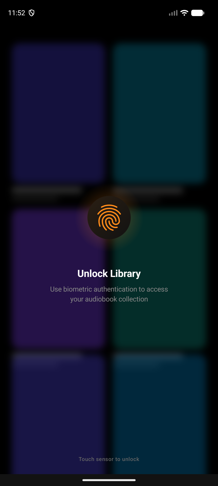  
  
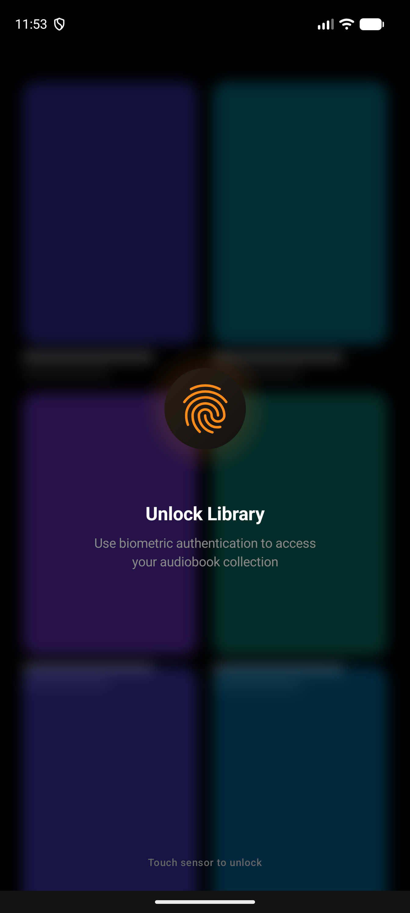  
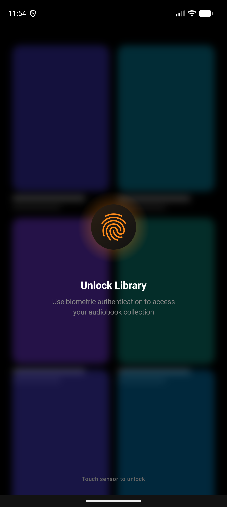

### UI flow diagram

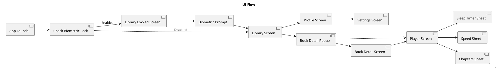

### Component diagram

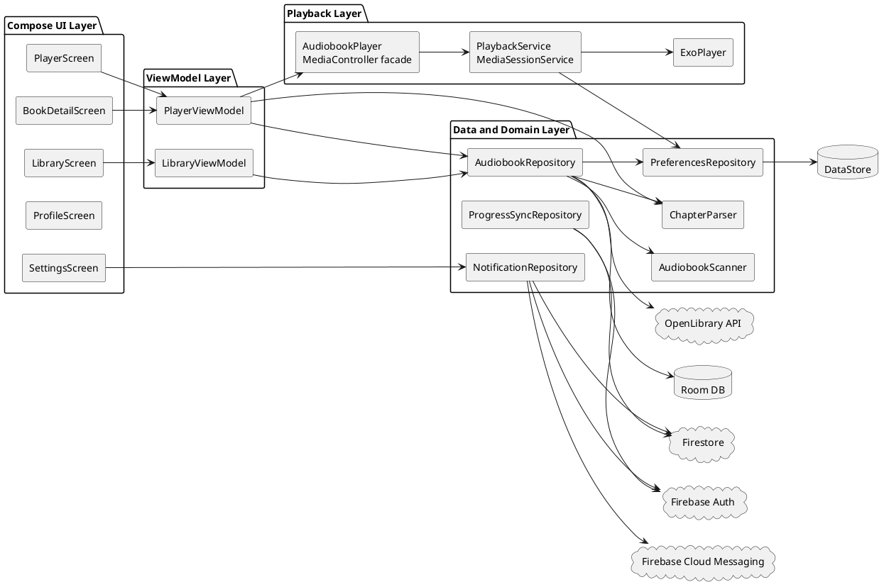

### Use case diagram (selected non-trivial use cases)

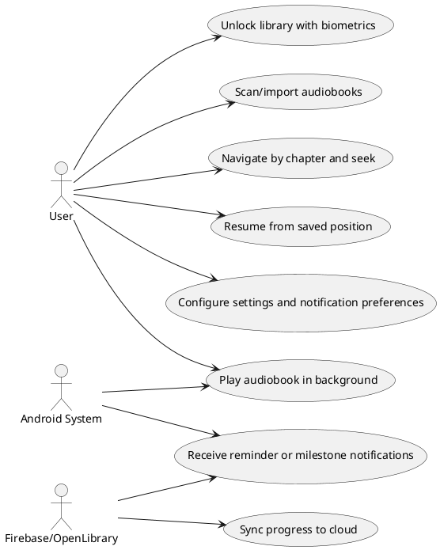

### Sequence diagram - Audio playback flow

The following sequence diagram illustrates the complete audio playback lifecycle, from user interaction through the UI layer, down to the Media3 playback service, and back up with state updates.

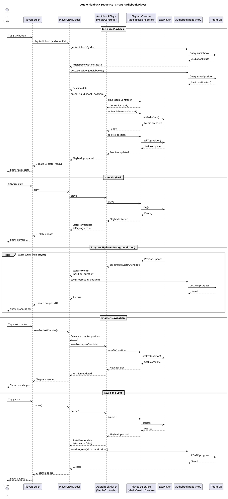

This sequence captures the key interactions:
1. **Initialization:** Loading audiobook data and last saved position from Room DB
2. **Media preparation:** Setting up the Media3 ExoPlayer through the service layer
3. **Playback control:** Starting/pausing playback with bidirectional state updates
4. **Progress tracking:** Continuous position saves every 500ms during playback
5. **Chapter navigation:** Calculating and seeking to chapter boundaries
6. **State management:** StateFlow-based reactive updates from service to UI

### Exported diagram outputs (PUML)

After running the export script, include these rendered outputs in the final PDF package:
- `diagrams/exports/ui_flow.png`
- `diagrams/exports/component_diagram.png`
- `diagrams/exports/use_case_diagram.png`
- `diagrams/exports/sequence_playback.png`

Rendered outputs:

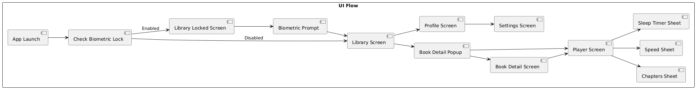

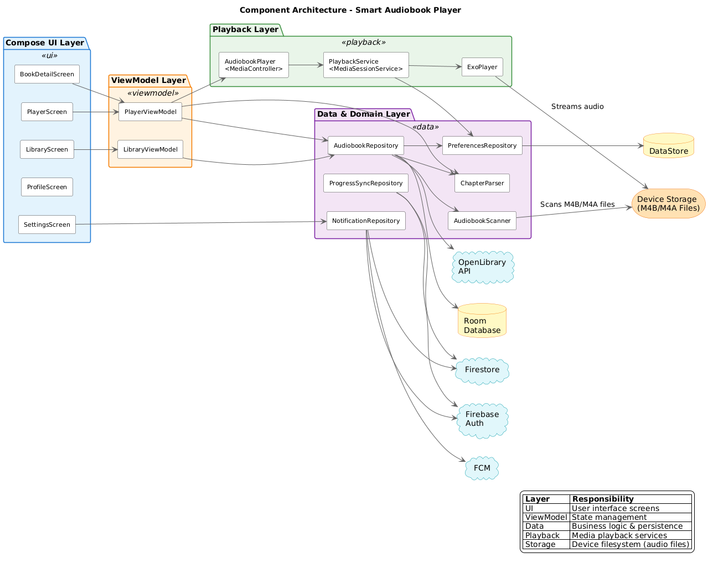

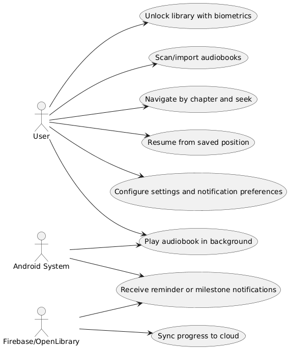

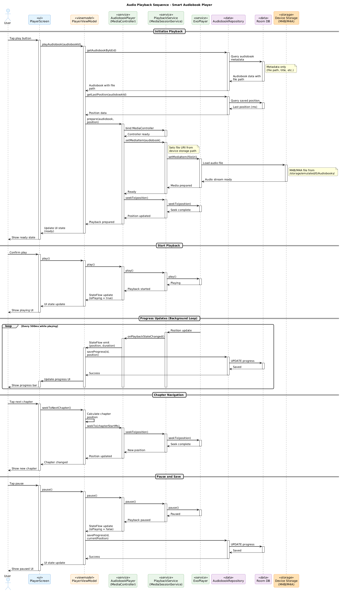

---

## Conclusion

Smart Audiobook Player delivers a strong end-to-end Android audiobook experience that aligns with the course goals and the original synopsis direction.The project demonstrates practical use of modern Android architecture and media APIs, especially through the Media3 `MediaSessionService` approach, chapter-aware playback logic, and a Compose-first UI implementation.

From a technical perspective, the main success is the playback architecture: decoupling UI from media service, preserving playback continuity, and supporting audiobook-specific controls such as 15s/30s skip, chapter navigation, speed control, and sleep timer. The implementation also shows good persistence strategy through Room and DataStore, enabling reliable local resume behavior.

Firebase and notification capabilities are present and substantial, and the project includes advanced ideas such as engagement tracking and milestone-based reminders. In addition, metadata and chapter extraction challenges were investigated deeply, and chapter compatibility improvements were documented, including fallback parsing strategies and generation-side chapter metadata fixes.

The most important insights gained during development were:
- Media containers are inconsistent in chapter metadata encoding, so robust fallback parsing is essential.
- Long-form audio apps need frequent but controlled persistence updates to balance accuracy and performance.
- Cloud sync is not only a repository problem; it must be carefully wired into lifecycle and conflict-resolution flows to become truly production-ready.
- UX security features (such as biometrics) require complete settings integration, not just prompt-level implementation.

Overall, the project is technically mature in core playback and UI/UX foundations and provides a solid baseline for future production hardening.

---

## Known Bugs and Issues

| ID | Issue | Impact | Current Evidence | Suggested Next Step |
|---|---|---|---|---|
| K1 | Dedicated sign-in/sign-up UI flow is not fully wired in navigation | Users cannot complete full account lifecycle in-app from a clear auth screen flow | Auth repository exists, but navigation does not define auth screens | Add explicit auth screens and route guards tied to auth state |
| K2 | Profile uses static `UserProfile.default` data | Profile screen does not reflect real Firebase user/account stats | `ProfileScreen` currently binds default guest profile object | Bind profile to `AuthRepository` + Firestore user document |
| K3 | Biometric fallback bypass remains in demo path | On unsupported devices, lock can be bypassed, weakening security expectation | `MainActivity` contains "bypass for demo" fallback | Replace bypass with strict policy or explicit PIN/passcode fallback |
| K4 | Biometric preference write path is unclear | Lock setting may not be consistently user-configurable | `rememberBiometric` is read; `setRememberBiometric(...)` has no obvious UI call site | Add setting toggle and persistence flow validation |
| K5 | Firestore progress sync repository is underused in main flow | Cross-device continuity may be incomplete in real usage | `ProgressSyncRepository` API exists but few/no integration call sites | Integrate save/pull/observe in startup, playback pause, and conflict points |
| K6 | Notification error paths often swallow exceptions | Notification failures can remain invisible and hard to debug | Multiple `Silently fail` catch blocks in notification services/repositories | Replace silent catch with structured logging and retry/backoff policy |
| K7 | Notification icons still use placeholder system icon | Inconsistent branding and potentially lower notification quality | TODO comments in scheduler and FCM service | Replace with app-specific monochrome notification icon |
| K8 | Automated app tests are not currently present in source tree | Regression risk is higher as features grow | Test dependencies configured, but no files found under `app/src/test` or `app/src/androidTest` | Add unit tests for view models/repositories and instrumented smoke tests |
| K9 | Chapter metadata format compatibility depends on source format | Some M4B files may still need regeneration for reliable chapter behavior | Chapter fix docs note MDTA reliability limits and recommend Nero chapters | Standardize chapter generation pipeline (prefer Nero/mp4chaps) |

---

## Final Note

This report is written in the same language as the synopsis (English) and follows the required section order from the project report rubric.
