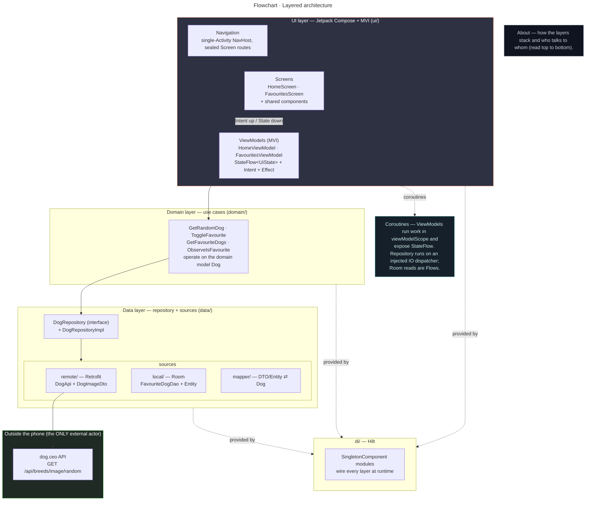
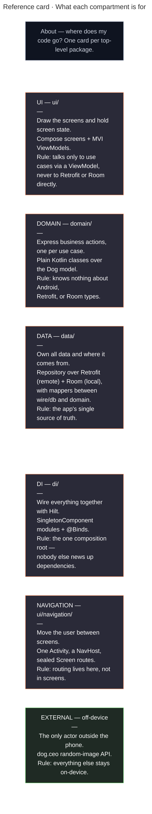
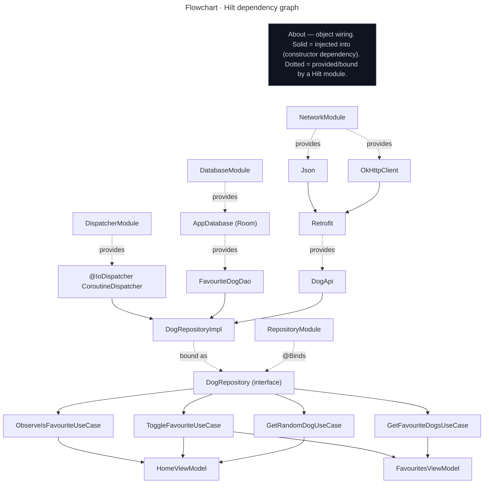
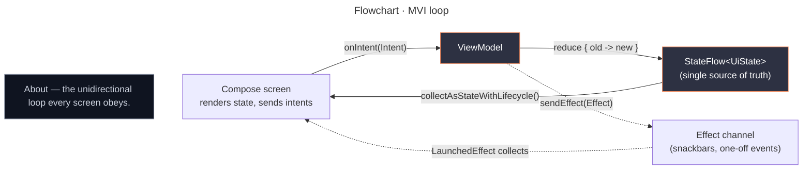

# Architecture (Technical Diagrams)

Visual companion to [`DECISIONS.md`](DECISIONS.md). Every diagram below is **Mermaid** — it
renders inline on GitHub and in most IDEs (VS Code with the Mermaid extension, Android
Studio with a Markdown plugin). The diagrams reflect the code as it actually is: a
single-module Android app (Kotlin + Jetpack Compose + Hilt + Retrofit + Room) that follows
**Google's recommended app architecture** with an **MVI** presentation layer. The only
external actor is the public **dog.ceo** image API.

The app is deliberately small — show a random dog, fetch another, favourite it, browse a
gallery. The point of these diagrams is to show that even a trivial feature set is mapped
cleanly onto a layered, testable, swappable architecture.

---

## 1. Layered architecture (the big picture)

Read top-to-bottom. Each layer only talks to the one below it. The UI never touches
Retrofit or Room directly — it goes through a ViewModel, then a use case, then a repository.



---

## 2. What each compartment is for (note card)

One card per top-level package. Read it as: **compartment — one-sentence job — the rule it
obeys.** This is the "where does my code go?" cheat sheet.



> Mental model: a tap travels **NAVIGATION → UI → (ViewModel) → DOMAIN → DATA**, occasionally
> reaching **EXTERNAL**; **DI** built all of them, and Room feeds reactive `Flow`s back up.

---

## 3. Dependency graph (who provides whom — Hilt)

Hilt is the composition root. `@Module`s in `di/` declare how to build each type; everything
is a `SingletonComponent`-scoped singleton except the ViewModels (their own scope). This is
the framework-generated equivalent of a hand-written container.

> **Reading the arrows.** Two relationships, two line styles:
> **solid `A --> B`** = *A is injected into B* (A is a constructor dependency of B);
> **dotted `A -.provides.-> B`** = *a Hilt @Provides/@Binds creates B*. The modules **provide**
> the leaf objects; everything else is **injected** by constructor.



> Note the seam at `DogRepository`: use cases depend on the **interface**, never on
> `DogRepositoryImpl`. Swap the backend (a different API, an in-memory fake for tests) without
> touching a single use case. That seam is what makes the repository unit-testable with fakes.

---

## 4. The MVI loop (how state changes)

The defining shape of the UI layer. There is exactly **one** immutable state object per
screen, changed **only** through a reducer, driven **only** by intents. One-off things that
aren't state (a snackbar) travel out as effects.



> Why MVI here and not plain MVVM: see [`DECISIONS.md` #2](DECISIONS.md). Short version —
> it's a stricter form of the unidirectional data flow Google already recommends, and the
> `MviViewModel<S, I, E>` base keeps both screens consistent.

---

## 5. Random dog — the fetch + error path (sequence)

The core feature. Note the two things worth explaining: state goes `Loading → Success`
through the reducer, and a network failure becomes a **first-class error state** with a
Retry intent — never a crash, never a leaked exception.

```mermaid
---
title: "Sequence diagram · Fetch a random dog"
---
sequenceDiagram
    participant U as User
    participant S as HomeScreen
    participant VM as HomeViewModel
    participant UC as GetRandomDogUseCase
    participant R as DogRepository
    participant API as DogApi
    participant DOG as dog.ceo

    note over U,DOG: About — a "New dog" tap becomes a grounded state change, success or failure.
    U->>S: tap "New dog"
    S->>VM: onIntent(LoadNewDog)
    VM->>VM: reduce { isLoading = true }
    VM->>UC: invoke()
    UC->>R: getRandomDog()
    R->>API: getRandomDog() (suspend, on @IoDispatcher)
    API->>DOG: GET /api/breeds/image/random

    alt success
        DOG-->>API: { message: url, status: success }
        API-->>R: DogImageDto
        R-->>UC: Result.success(Dog)  (DTO→Dog, breed parsed from url)
        UC-->>VM: Result.success(Dog)
        VM->>VM: reduce { isLoading = false; dog = it }
        VM-->>S: StateFlow emits → recompose (image fades in via Coil)
    else failure (offline / timeout / parse)
        DOG-->>API: error
        API-->>R: throws
        R-->>UC: Result.failure(e)  (wrapped in runCatching)
        UC-->>VM: Result.failure(e)
        VM->>VM: reduce { isLoading = false; errorMessage = "…" }
        VM-->>S: ErrorState with Retry button
        U->>S: tap Retry
        S->>VM: onIntent(Retry) → loop again
    end

    note over VM: isFavourite is kept live by collecting ObserveIsFavouriteUseCase(url)<br/>for the current dog and reducing each emission into state.
```

---

## 6. Favourite & gallery — Room as the single source of truth (data flow)

How a like is stored and how the gallery stays in sync. The key idea: nobody manually
refreshes the gallery. Room emits a `Flow`; toggling a favourite writes to Room; the new row
set flows back up and the grid recomposes on its own.

```mermaid
---
title: "Flowchart · Favourite & gallery data flow"
---
flowchart LR
    classDef about fill:#0f1420,stroke:#8a93a6,color:#cdd3df
    CARD["About — how a like is stored and how the gallery updates with no manual refresh."]:::about
    CARD ~~~ Heart

    subgraph Write["Toggling a favourite"]
        Heart["Tap ♥ on HomeScreen"] -->|"onIntent(ToggleFavourite)"| HVM["HomeViewModel"]
        HVM --> UC["ToggleFavouriteUseCase"]
        UC --> Repo["DogRepository"]
        Repo -->|"insert / deleteByUrl"| Room[("Room DB<br/>favourites")]
    end

    subgraph Read["Showing the gallery + live heart"]
        Room -->|"observeAll(): Flow&lt;List&gt;"| Repo2["DogRepository"]
        Repo2 --> UC2["GetFavouriteDogsUseCase"]
        UC2 --> FVM["FavouritesViewModel<br/>(stateIn)"]
        FVM -->|StateFlow| Grid["FavouritesScreen grid"]
        Room -->|"observeIsFavourite(url): Flow&lt;Boolean&gt;"| HVM2["HomeViewModel"]
        HVM2 --> HeartState["♥ filled / outline"]
    end

    classDef db fill:#3a3a4a,stroke:#8aa,color:#fff
    class Room db
```



---

## Notes on the key terms

For each term: **what it is** (plain English) · **why it's here** (how *this* app uses it) ·
**a one-line answer** you can give if an interviewer asks. Grouped by the layer it lives in.

### UI layer

**Jetpack Compose / Composable**
- *What:* Android's modern declarative UI toolkit. A composable function *describes* the
  screen for the current state; the framework redraws when state changes. No XML layouts.
- *Here:* `HomeScreen`, `FavouritesScreen`, and the shared `DogImage`/`LoadingState`/`ErrorState`.
- *"The UI is declarative — I describe the screen as a function of state and Compose handles redraw."*

**ViewModel**
- *What:* A state holder that outlives the screen (survives rotation/config changes).
- *Here:* `HomeViewModel`, `FavouritesViewModel`, both extending the `MviViewModel` base. The
  screen sends intents up; the ViewModel exposes state down.
- *"ViewModels own screen state and survive configuration changes — the seam between dumb UI and the domain."*

**StateFlow / UiState**
- *What:* A `StateFlow` is an observable stream that always holds a current value. `UiState`
  is the single immutable data class describing everything the screen needs to render.
- *Here:* `HomeUiState(isLoading, dog, isFavourite, errorMessage)` and `FavouritesUiState`.
  Collected with `collectAsStateWithLifecycle()`.
- *"One immutable state object per screen, exposed as StateFlow — the single source of truth for the UI."*

**MVI (Model–View–Intent)**
- *What:* A unidirectional pattern: immutable **State**, a sealed set of **Intents** (the only
  way in), an optional sealed set of **Effects** (one-off side events), and a **reducer** that
  produces the next state.
- *Here:* Each screen has a `…Contract.kt` with State/Intent/Effect; `onIntent()` is the only
  entry point; state changes only via `reduce { }`. The reusable `MviViewModel<S, I, E>` base
  enforces this.
- *"MVI: state is immutable and only the reducer changes it, intents are the only input, effects carry one-off events out."*

**UDF (Unidirectional Data Flow)**
- *What:* State flows down, events flow up — never the reverse.
- *Here:* `state` ↓ to the screen, `onIntent(...)` ↑ to the ViewModel. MVI is a strict UDF.
- *"Data flows one way: state down to the UI, intents up to the ViewModel."*

### Domain layer

**Use case**
- *What:* A small class representing one business action, decoupling the ViewModel from the
  repository and keeping logic testable in isolation.
- *Here:* `GetRandomDogUseCase`, `ToggleFavouriteUseCase`, `GetFavouriteDogsUseCase`,
  `ObserveIsFavouriteUseCase` — each `operator fun invoke(...)` over the `Dog` model.
- *"Use cases name the app's actions and keep ViewModels thin; they're trivially unit-testable."*

**Domain model (`Dog`)**
- *What:* The framework-light type the UI and domain speak in — distinct from the wire DTO and
  the DB entity.
- *Here:* `Dog(imageUrl, breed)`. Mappers convert `DogImageDto`/`FavouriteDogEntity` ⇄ `Dog`, so
  the API shape and DB shape can change without touching the UI.
- *"The domain model is decoupled from the wire and DB shapes; mappers translate at the data-layer edge."*

### Data layer

**Repository**
- *What:* The class a use case asks for data; it hides *where* the data comes from (network, DB,
  or a mix) behind plain function calls.
- *Here:* `DogRepository` (interface) + `DogRepositoryImpl` — pulls random dogs from `DogApi`,
  stores/reads favourites from `FavouriteDogDao`, exposes one clean API. Per Google's guidance
  the interface lives in the **data** layer (see [`DECISIONS.md` #5](DECISIONS.md)).
- *"The repository is the single source of truth for dog data and decouples the domain from Retrofit and Room."*

**Retrofit + kotlinx.serialization**
- *What:* Retrofit declares an HTTP API as a Kotlin interface; kotlinx.serialization parses JSON.
- *Here:* `DogApi.getRandomDog()` hits `dog.ceo`; `DogImageDto` is the `@Serializable` wire model.
- *"Retrofit declares the remote API as an interface; kotlinx.serialization does the JSON parsing."*

**Room / Entity / DAO**
- *What:* Room is a type-safe SQLite wrapper. An `@Entity` is one table row shape; a `@Dao` is
  the typed query surface (reads return `Flow`, writes are `suspend`).
- *Here:* `FavouriteDogEntity`, `FavouriteDogDao` (`observeAll` Flow, `observeIsFavourite` Flow,
  `isFavourite` suspend, `insert`, `deleteByUrl`), `AppDatabase` (schema exported to `app/schemas/`).
  Room is the **single source of truth** for favourites.
- *"Room is my local DB; reads are Flows so the gallery updates reactively, writes are suspend functions."*

**`Result`-based error handling**
- *What:* Kotlin's `Result<T>` wraps success/failure so callers handle errors as values, not exceptions.
- *Here:* `DogRepositoryImpl.getRandomDog()` returns `Result<Dog>` via `runCatching`; the ViewModel
  reduces failure into an error state. No exception ever reaches Compose.
- *"Network errors are first-class state, not crashes — the repository returns Result and the UI shows Retry."*

### Cross-cutting

**Hilt (DI)**
- *What:* Dependency injection = an object receives its dependencies from outside. Hilt generates
  the wiring at compile time and validates the graph.
- *Here:* `@HiltAndroidApp` Application; `@Module @InstallIn(SingletonComponent)` for network, DB,
  dispatcher; `@Binds` maps `DogRepository → DogRepositoryImpl`; `@HiltViewModel` + `hiltViewModel()`
  for the ViewModels. Required by the brief (see [`DECISIONS.md` #1](DECISIONS.md)).
- *"Hilt is the composition root — it builds and validates the dependency graph at compile time."*

**Coroutines / Flow / Dispatchers**
- *What:* Kotlin's async model. `suspend` pauses without blocking; a `CoroutineScope` cancels its
  jobs together; `Flow` is a cold stream; dispatchers pick the thread pool.
- *Here:* ViewModels launch in `viewModelScope` and expose `StateFlow`; the repository runs network
  + DB writes on an **injected** `@IoDispatcher` (injectable so tests stay deterministic); Room reads
  are `Flow`s mapped to domain models.
- *"Coroutines throughout: suspend off the main thread on an injected IO dispatcher, scopes tied to lifecycles, Flows bridging layers."*

**Coil**
- *What:* A Compose-native image-loading library.
- *Here:* `DogImage` uses Coil's `AsyncImage` to load the dog URL with caching and a crop.
- *"Coil for image loading — Compose-native AsyncImage with built-in caching."*

**Single-Activity + Compose Navigation**
- *What:* One Activity hosts a `NavHost`; destinations are Composables addressed by routes.
- *Here:* `MainActivity` → `RandomDogApp()` with a `NavigationBar`; routes are a sealed `Screen`
  (`Home`, `Favourites`).
- *"Single-Activity with Compose Navigation and sealed routes — the standard modern setup."*
