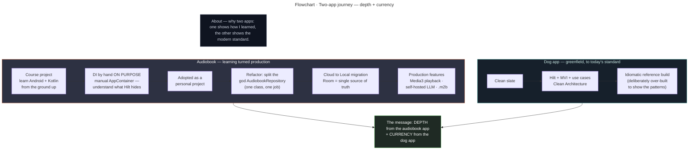
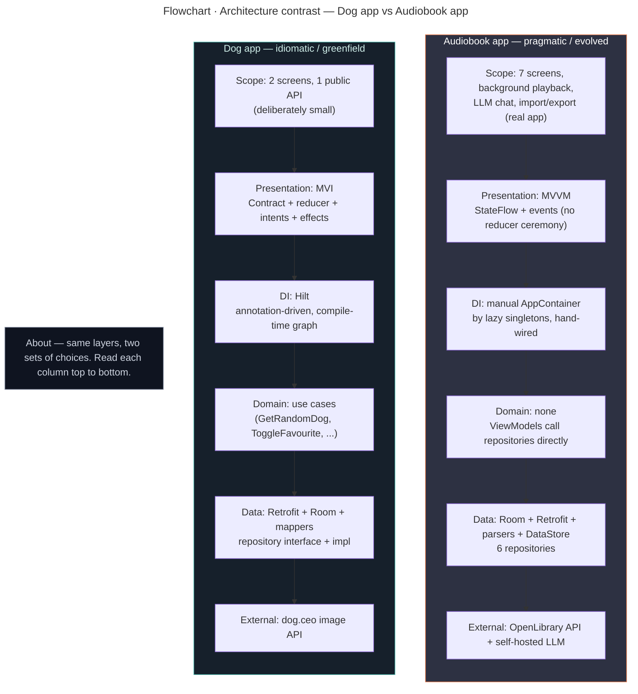
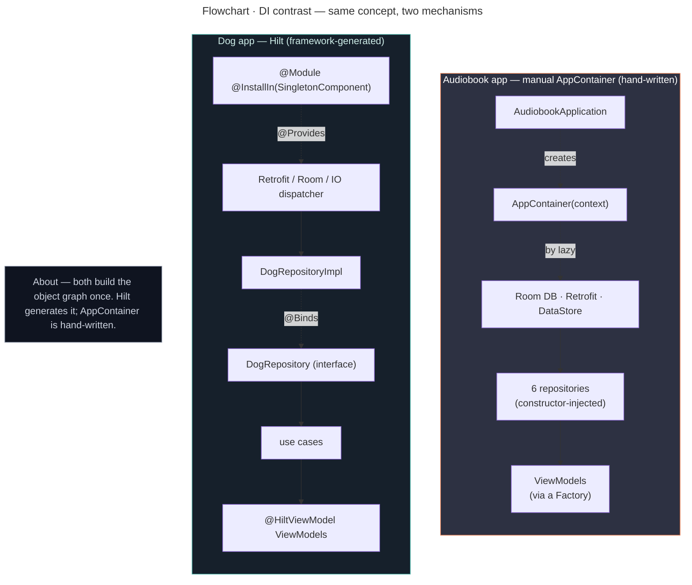
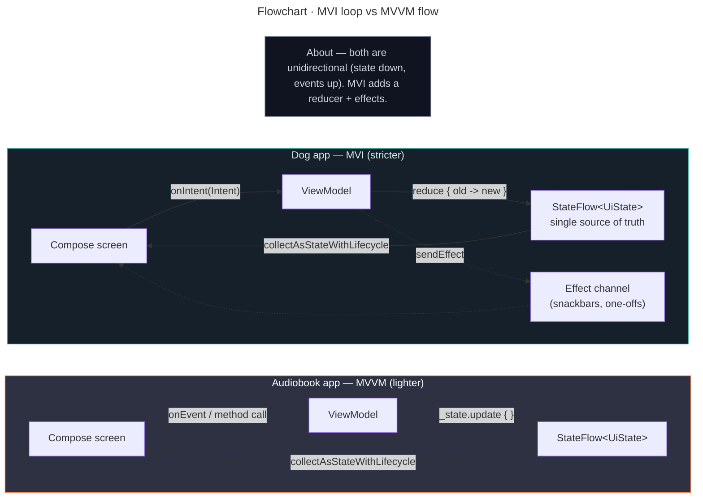
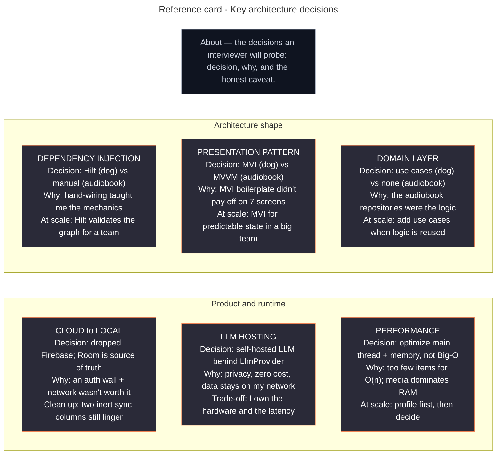
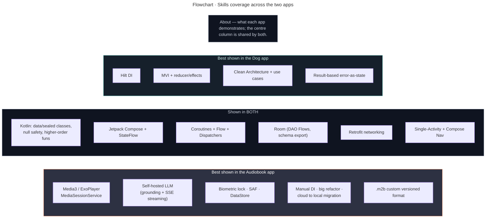

# Trifork Interview — Diagram Set + Q&A Prep

A single place to drive a **45-minute, diagram-led** technical interview for a **new-grad
Android developer** role (with a light nod to Trifork's AI/ML work). Two apps, one story:

> **The spine:** *My audiobook app is where I learned Android deeply by doing things by hand
> — manual DI, MVVM. The dog app is me proving I also build to today's idiomatic standard —
> Hilt, MVI, use cases. **Depth + currency.***

- **Audiobook = "learning turned production."** Started as a course project; I did
  dependency injection *by hand on purpose* to understand the mechanics Hilt hides, then
  refactored it toward production (split the god-repository, migrated cloud → local).
- **Dog app = "greenfield, to today's standard."** A clean-slate, idiomatic build.

This file holds the **new contrast diagrams** (the part that isn't already drawn), a
**curated index** of the existing per-app diagrams (so you know exactly which to open and
when), and a **Q&A section**. Pre-rendered PNGs live in [`diagrams/`](diagrams/).

| PNG | Diagram |
|-----|---------|
| `diagrams/01-two-app-journey.png` | §1 Two-app journey map |
| `diagrams/02-architecture-contrast.png` | §2 Side-by-side architecture contrast |
| `diagrams/03-di-contrast.png` | §3 DI: Hilt vs manual AppContainer |
| `diagrams/04-pattern-contrast.png` | §4 Pattern: MVI loop vs MVVM flow |
| `diagrams/05-decision-cards.png` | §5 Decision cards |
| `diagrams/06-skills-coverage.png` | §6 Skills coverage map |

> **Regenerating:** `npx -y @mermaid-js/mermaid-cli -i INTERVIEW_DIAGRAMS.md -o diagrams/d.png -t dark -b "#1e1e2e" --scale 3`
> writes `d-1.png … d-6.png` in document order. Rename them to the descriptive names above.

---

## 1. Two-app journey map (the narrative in one picture)

Open with this. It frames everything: the audiobook app earned its understanding the hard
way; the dog app demonstrates the modern standard. Both arcs converge on the same message.

---

## 2. Side-by-side architecture contrast (the spine diagram)

The single most important slide. Same layers, two sets of choices. Walk it top to bottom and
explain *why* each side differs. Expect "why the heavy stack on the small app?" — answer:
*the dog app is a demonstration vehicle, deliberately over-built so the patterns are visible.*

> **Talking point:** the contrast is intentional. Heavyweight, by-the-book patterns on the
> *small* app (easy to read, proves I know the canon); lighter, pragmatic patterns on the
> *large* one (where they grew organically and I optimized for a solo developer's velocity).

---

## 3. Dependency injection — Hilt vs manual `AppContainer`

The same job — a composition root that builds the object graph once — done two ways. This is
the diagram behind your best line: *"I did DI by hand so I'd understand what Hilt generates
before letting a framework do it for me."*

> **Both keep the interface seam:** the dog app's use cases depend on `DogRepository` (not
> the impl); the audiobook app's `BookCompanionRepository` depends on `LlmProvider` (not
> `LmStudioProvider`). Manual DI didn't cost me testability.

---

## 4. Presentation pattern — MVI loop vs MVVM flow

Why the dog app is MVI and the audiobook is MVVM. MVI is a *stricter* form of the same
unidirectional flow: one immutable state object, changed only by a reducer, plus an effects
channel. MVVM is looser — state down, events up, no reducer ceremony.

> **The honest line:** *"MVI's per-screen Contract + reducer is great discipline, but on a
> 7-screen solo app the boilerplate didn't earn its keep, so the audiobook uses plain MVVM.
> The dog app uses MVI to show I can apply the stricter pattern when a team wants it."*

---

## 5. Decision cards (decision → why → what I'd change)

One card per big decision. This is the "I have opinions and can defend them" slide Trifork
cares about. Each reads: **the decision · why I made it · what I'd do differently at scale.**

---

## 6. Skills coverage map (what each app proves)

A quick "breadth at a glance" reference — which competencies each app demonstrates, and the
big overlap in the middle. Useful if an interviewer asks "what have you actually built with?"

---

## 7. Curated index of EXISTING diagrams (which to open, in order)

You don't need to redraw these — they already render in the two `ARCHITECTURE.md` files and
(for the audiobook) as PNGs. This is the running order and the one line to say for each.

### Dog app — `TRIFORK/GIVEN CASE Final Interview/ARCHITECTURE.md`

| Order | Diagram (§ in that file) | What it shows | One line to say |
|------|--------------------------|---------------|-----------------|
| 1 | §1 Layered architecture | UI → domain → data, Hilt wiring | "Each layer talks only to the one below it." |
| 2 | §3 Hilt dependency graph | Who provides/injects whom | "Hilt is the composition root; the seam is at the repository interface." |
| 3 | §4 MVI loop | Intent → reduce → state → view | "One immutable state, changed only by the reducer." |
| 4 | §5 Fetch sequence | Success + failure paths | "A network error is a first-class state with Retry, never a crash." |

### Audiobook app — `Final Submission Project/ARCHITECTURE.md` (+ `docs/diagrams/*.png`)

| Order | Diagram | What it shows | One line to say |
|------|---------|---------------|-----------------|
| 5 | §1 Layered architecture | UI / data / service / DI layers | "Playback lives in its own service layer, not the Activity." |
| 6 | §4 Playback sequence | Play tap → MediaSession → ExoPlayer → progress saved | "Audio survives the screen dying because it's in a MediaSessionService." |
| 7 | §8 Cloud before / after | Firebase → local-only | "I removed the auth wall and made Room the single source of truth." |
| 8 | §5 Book Companion (LLM) | Grounding + SSE streaming | "Book context is injected so the model can't make things up; the reply streams in." |

> **Suggested full run:** §1 journey (this file) → dog app diagrams 1–4 + dog code →
> §2 contrast (this file) → §3 DI + §4 pattern (this file) → audiobook diagrams 5–8 →
> §5 decision cards (this file) → close.

---

## 8. Q&A prep

Crisp, defensible answers. Each is a *spoken* answer — short, with the reasoning, ending on a
trade-off or a "what I'd do at scale" so it sounds senior-aware without over-claiming.

### The contrast (they WILL ask this)

**Q: Why Hilt on the tiny app but manual DI on the big one — isn't that backwards?**
"On purpose. The audiobook app started as a learning project, so I wired DI by hand to
understand the mechanics a framework hides — object lifetimes, the composition root, the
interface seams. The dog app is greenfield, so it shows the modern standard: Hilt generating
and validating the graph at compile time. On a real Trifork team I'd use Hilt — it pays off
the moment more than one person touches the graph."

**Q: Why MVVM on the audiobook instead of MVI?**
"MVI is a stricter unidirectional flow — one state object, a reducer, an effects channel.
Great discipline, but the per-screen Contract boilerplate didn't earn its keep across seven
screens with one developer. The dog app uses MVI to show I can apply the stricter pattern;
the audiobook uses plain MVVM because it was the right amount of structure for the job."

**Q: Why use cases in the dog app but not the audiobook?**
"In the audiobook the repositories *were* the business logic — a use-case layer would've been
pure indirection. The dog app has them because that's the canonical Clean Architecture shape
and it keeps the ViewModels trivially thin. I'd add use cases the moment logic is shared
across multiple ViewModels."

### Kotlin & Compose fundamentals

**Q: Explain coroutines / structured concurrency.**
"`suspend` lets a function pause without blocking a thread. A `CoroutineScope` owns its jobs
and cancels them together — that's the 'structured' part. In my apps, ViewModels launch in
`viewModelScope` (auto-cancelled with the screen), and disk/network work runs on
`Dispatchers.IO` so the main thread stays free."

**Q: Flow vs StateFlow?**
"A `Flow` is a cold stream — it runs when collected. `StateFlow` is hot and always holds a
current value, which is exactly what UI needs. Room DAOs return `Flow`; I lift them into
`StateFlow` with `stateIn(...)` and collect with `collectAsStateWithLifecycle()`, so the UI
recomposes automatically when the database changes."

**Q: What is recomposition?**
"Compose re-runs a composable when the state it reads changes. The skill is reading state at
the narrowest scope so you recompose as little as possible — and never doing heavy work
inside a composable body."

**Q: Why sealed classes / how does null safety help?**
"Sealed types give me exhaustive `when` — the compiler forces me to handle every Intent or
UI state, so adding a case can't silently slip through. Null safety means the type system
makes me handle 'no value' explicitly instead of risking an NPE at runtime."

### Audiobook depth

**Q: Why Media3 / a MediaSessionService instead of MediaPlayer?**
"Audio has to keep playing when the Activity is gone, so playback lives in a
`MediaSessionService` the OS owns, and the UI controls it remotely through a
`MediaController`. Because it publishes a media session I get lock-screen, Bluetooth, and
Android Auto controls for free. Plain `MediaPlayer` couldn't do the chapter seeking,
metadata, and session integration I needed."

**Q: What's the hard part of real audio playback?**
"The etiquette: audio focus (pause/duck for a call or notification), 'becoming noisy' (pause
when headphones unplug), and a wake lock so playback doesn't stall when the screen sleeps. I
configure all three on the ExoPlayer instance — that's the line between a real media app and
a toy."

**Q: Tell me about the cloud-to-local migration.**
"It started Firebase-backed — Auth plus a Firestore progress mirror behind a sign-in wall. I
realized the cross-device case didn't justify an account requirement and a network dependency
for media that already lives on the device. So I made Room the single source of truth and
added a portable `.m2b` export/import for the rare move-my-progress case. The win: zero
accounts, no network dependence, smaller attack surface."

**Q: What would you clean up next?**
"Two columns on `ProgressEntity` — `isSyncedToCloud` and `chapterProgressJson` — plus a
couple of DAO methods survive from the Firebase design. They're inert; I left them to avoid a
schema migration. That's the first thing I'd remove with a proper migration."

**Q: How do Room migrations work / have you done one?**
"Room generates SQL from annotated entities and checks it at compile time. I export the
schema to `app/schemas/` (v1–v4) so every change has a paper trail, and I write a `Migration`
when a column changes. Reads return Flows; writes are suspend functions."

**Q: How does the app read files — why SAF?**
"Storage Access Framework: the user points the app at their audiobook folder via
`ACTION_OPEN_DOCUMENT_TREE` and I read through `DocumentFile`. It's scoped, user-controlled,
and Play-Store-friendly — you can't just grab raw file paths on modern Android."

### AI / ML nod

**Q: How does the Book Companion avoid hallucinating about the book?**
"Grounding. Before the model sees the question I build a preamble with the title, author,
chapter list, and current position and merge it into the first user message. The prompt
builders are pure functions, so they're unit-tested."

**Q: How does streaming work?**
"The LLM responds over Server-Sent Events — `data: {delta}` lines until `data: [DONE]`. I
parse each delta into a `Flow<String>` (a cold `flow { }.flowOn(Dispatchers.IO)`) and the
ViewModel appends each token to state, so the reply fades in instead of appearing all at once."

**Q: On-device vs cloud vs self-hosted LLM — trade-offs?**
"On-device is the most private but limited by phone hardware. Cloud is the most capable but
costs per call and sends data off the device. I self-host on my homelab: capable enough,
zero per-call cost, and nothing leaves my network. Because I program to an `LlmProvider`
interface, I can swap any of the three without touching the repository — that's the same
data-sovereignty instinct behind Trifork's sovereign-AI product."

### New-grad / cross-tech

**Q: What about Big-O / performance?**
"For a single-user local app the item counts are too small for Big-O to matter. The real
mobile performance work is keeping work off the main thread so the UI doesn't stutter, and
watching memory — cover images and audio buffers dwarf any list. I know the Big-O basics, but
I won't pretend they're the bottleneck here."

**Q: Have you heard of Kotlin Multiplatform / Ktor?**
"KMP shares logic (data, networking, rules) across Android and iOS while keeping native UI.
My apps are Android-only so I used Retrofit; if I wanted to share networking with iOS I'd
switch to Ktor, which is multiplatform."

**Q: What was hardest, and what would you do differently?**
"Hardest was real background playback — getting the service lifecycle, audio focus, and
progress persistence all correct. What I'd do differently: I'd reach for Hilt from the start
on a team project, and I'd have written the `.m2b` format with migration in mind from day one
rather than bolting versioning on."

**Q: Why should we hire a new grad who built hobby apps?**
"Because I taught myself to build *real* things off my own initiative — background media
playback, a self-hosted LLM feature, a cloud-to-local refactor — and I can explain every
decision and its trade-off. That's the self-driven, keeps-learning profile your posting asks
for, and it lines up with where Trifork is going on sovereign AI and data ownership."
